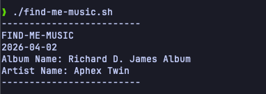

# find-me-music

A shell script that randomly chooses one of the most popular albums on [Last.fm](https://www.last.fm) to listen to. I never listen to much new music so I figured this would help.


## Example Output


## Requirements

- Bash (or compatible shell)  
- curl (for HTTP requests)  
- Last.fm API key ([get one here](https://www.last.fm/api/account/create))

## How to Use

1. **Clone the repository**

```bash
git clone https://github.com/JosephMcLean118/find-me-music.git
cd find-me-music
```

2. **Make the script executable from anywhere**
```bash
chmod +x find-me-music.sh
```

3. **Run the script**
```
find-me-music
```
